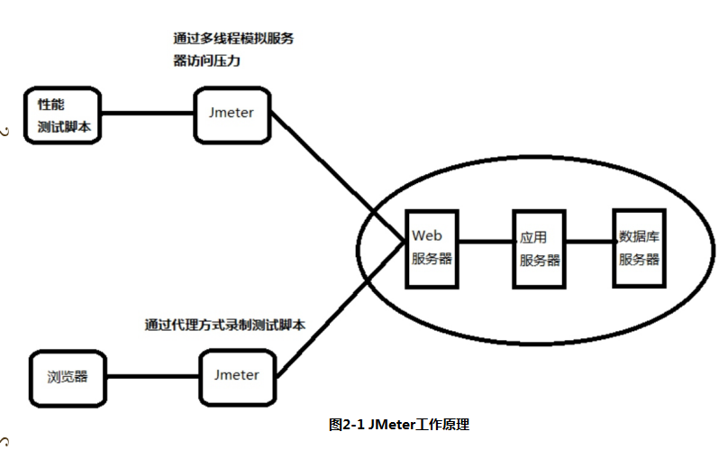
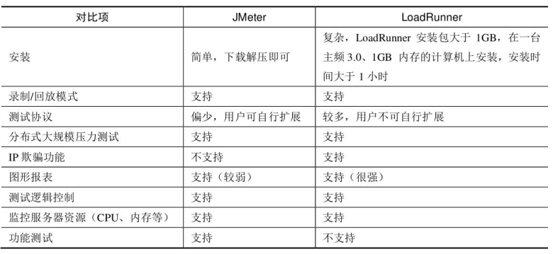

## Jmeter基础知识
## Jmeter简介
### Jmeter主要特点
* 支持多种协议进行测试
* 支持录制回放获取脚本
* 高可移植性，100%java应用
* 采用多线程框架
* 精心设计GUI,支持高速用户操作、基准记时
* 支持缓存离线方式回放、分析测试结果
* 高扩展性
### Jmeter常用术语
* 采样器（sampler）
    * jemter测试脚本基础单元，向服务器发送指定请求，超时前获取响应
* 逻辑控制器（logic Controller）
    * 控制Jmeter测试脚本的执行顺序，以便按照用户期望的顺序和逻辑执行
* 监听器（Listener）
    * 收集测试结果信息，以用户指定格式呈现
* 配置元件（Configuration Element）
    * 设置Jmeter测试脚本公用的信息
* 断言（Assertion）
    * 验证服务器返回信息与用户期望结果是否匹配
* 定时器（Timer）
    * 用来保存与时间相关的信息，eg：思考时间
* 前置处理器（Pre-Processor）
    * 前置处理器作用范围内，任何采样器执行前，都要经过前置处理器 
* 后置处理器（Post-Processor）
    * 后置处理器作用范围内，任何采样器执行后，都要经过后置处理器
* 测试计划（Test Plan）
    * JMeter测试脚本的根节点，测试脚本的一些基础设置，可以在测试计划中制定，eg:用户定义变量
* 线程组（Thread Group） 
    * 定义虚拟用户池，每个虚拟用户都使用相同的测试脚本
### Jmeter测试结果字段的意义
* Lable:定义http请求名称
* Sampler：这次测试中一共发送的请求数
* Average: 平均响应时长--单个请求的平均响应时长
* Median:中位数，也就是50%用户的响应时长
* 90%Line:百分之90的用户的响应时长
* Min:访问页面最小响应时长
* Max:服务页面最大响应时长
* Error%:错误请求数/总请求数
* Throughput：每秒完成的请求数
* KB/Sec:每秒从服务器接收到的数据量
### Jmeter工作原理

### Jmeter运行+配置
### Jmeter VS LoadRunner

