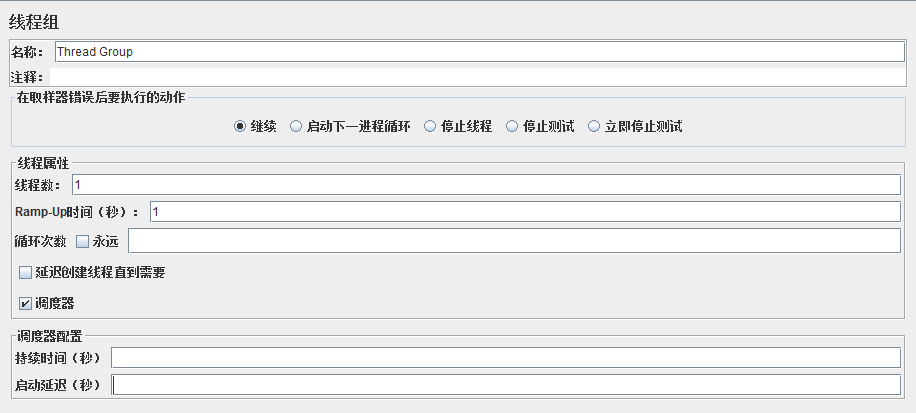

## Web性能测试脚本的录制与开发
### Jmeter常用测试元件
#### 1.线程组

* Ramp-Up Period：达到最大线程数所需时间
    * 建议初始值=总线程数，后续再根据实际情况进行增减
#### 2.控制器
##### 采样器
##### 逻辑控制器
#### 3.测试片段
#### 4.监听器
#### 5.定时器
#### 6.断言
#### 7.配置元件
#### 8.前置+后置处理器
### Jmeter脚本开发
#### 1.执行顺序
配置元件-前置处理器-定时器-采样器-后置处理器-断言-监听器
#### 2.作业域
* 分层规则：监听器、配置元件、前置后置处理器、断言、定时器
* 顺序规则：逻辑控制器、采样器
#### 3.Jmeter属性和变量（大小写敏感）
* 属性：在配置文件jmeter.properties中
* 变量：线程不安全
### 录制测试脚本
* 使用代理录制
* 使用BadBoy录制

