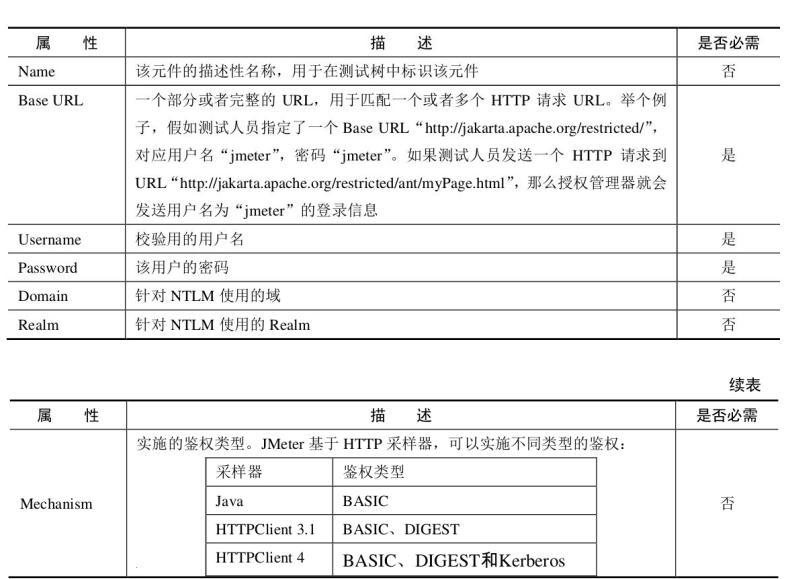
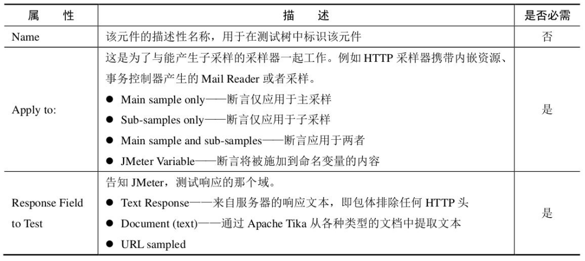
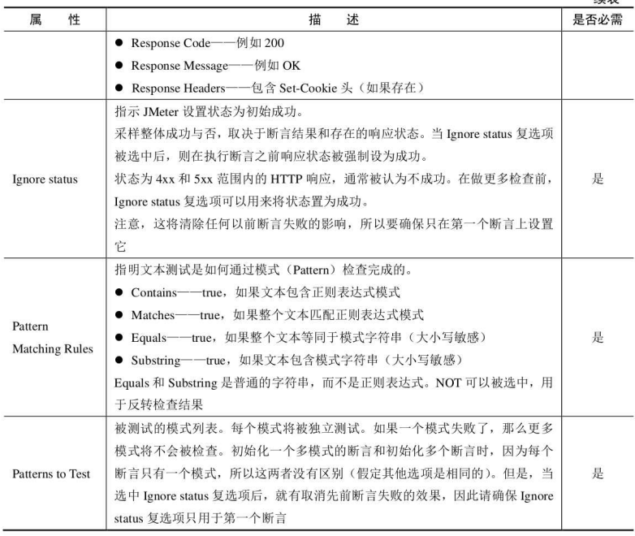
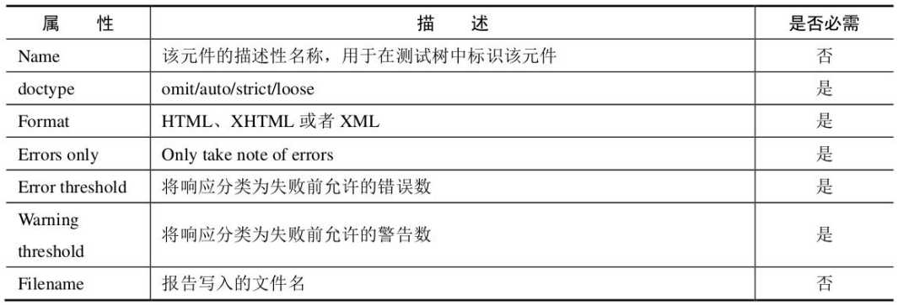

## Jmeter测试元件
### 监听器（Listener）
* 不同的监听器以不同的方式展示服务器响应信息。共通点是都将原始数据记录到某个输入文件中。
* Configure按钮配置输出文件的结果域，以及输出文件的格式（xml、csv(占用空间小)）
#### 监听器资源占用
* 减少内存占用使用Simple data writer,并使用csv文件输出
### 逻辑控制器
决定采样器的执行顺序
#### SimpleController
* 用途：组合采样器以及其他逻辑控制器
* 不会提供除存储设备之外的其他功能
#### LoopController
* 可以设置采样器循环次数
#### OnceOnlyController
* 只在父循环控制器的第一次执行（线程组、循环控制器）
#### InterleaveController(交替控制器)
* 将采样器或逻辑控制器放置在交替控制器下，每一次循环会jmeter会交替执行该控制器下的测试元件
* 属性：Ignore sub-controller blocks---选中该复选框，交替控制器会将其下的子控制器当做交替控制器处理
#### RandomContrller
* 类似于交替控制器，不同在于旗下的子测试元件执行是无序的
#### 随机顺序控制器（random order controller）
* 子测试元件最多执行一次，且无序
#### Throughput Controller
* Exceution Style :percent exceution(执行固定比例的循环次数)/total exceutions(执行固定次数的循环)
* Per User:总执行次数是否按照人数*循环次数来计算
#### Runtime Controller
* 控制子测试元件允许运行的时长，超过配置时间不继续执行该控制器子元件
#### Recording Controller
* 指明了代理服务器录制的采样的存放位置，运行期间等同于simple controller
#### Critical（关键的） Section(部门) Controller：临界区控制器
* 确保子元件只会被一个线程执行（线程安全）
* 【注意】此控制器只在一个JVM内部上锁，如果分布式测试，确保测试不依赖于所有JVM的所有线程
#### If Controller
* 控制子元件是否执行，默认使用javascript的语法进行判断
* Interpret Condition as Variable Expression?：选中这一项时表示：判断变量值是否等于字符串true（不区分大小写）
* Evaluate for all children：如果选中这一项，在每个子结点执行前都会计算表达式
#### While Controller
* 一直运行子测试元件，知道条件变为false
* 属性 
    * Blank:循环中有采样失败了退出循环
    * LAST: 循环中有采样失败了退出循环,如果循环前最近的采样失败了，不进入循环
    * Otherwise：当条件等同于false是退出循环（javascript/Beanshell/属性/变量）
#### Switch Controller
* Switch Controller的作用类似于Interleave Controller ，因为它在每次迭代时运行一个从属元素，但不是按顺序运行它们，控制器运行由switch值定义的元素
* 开关值也可以是名称。
* 如果开关值超出范围，它将运行第0个元素，因此它将作为数字大小写的默认值。如果值为空字符串，它还会运行第零个元素。
* 如果该值为非数字（且非空），则Switch Controller将查找具有相同名称的元素（大小写很重要）。如果没有名称匹配，则选择名为“ default ”（不重要）的元素。如果没有默认值，则不选择任何元素，并且控制器不会运行任何操作。
#### ForEach Controller
* 实例：
    * 1.可以根据用户的多个变量依次被循环调用，直到最后一个变量被调用即结束循环。
    * 2.用户变量的要求是前缀有一定规律，需要循环的多个变量前缀要求一致。如图：
        
    * 3.配置ForEach controller，将“用户定义的变量名" 的前缀添加好，并设置【输出变量名称】
        
    * 4.应用到具体的脚本中，并添加察看结果树，查看结果
        

#### Module Controller
* 引用指定的测试模块
* eg：
```
涉及到JMeter提供的两个元素：
Module Controller【右键 Thread Group - Add - Logic Controller - Module Controller】
Test Fragment 【右键 Test Plan - Add - Test Fragment - Test Fragment】
一般，将Test Fragment放在线程组的外面，然后在线程组中新建Module Controller，在Module To Run下面选择需要的Test Fragment 即可。这样，在执行线程组中的Module Controller即相当于执行了Test Fragment。
```
#### Include Controller
* 包含控制器用于使用外部的Jmx文件。
* 条件：为了演示使用它，可以添加一个simple controller,然后在其中添加一个采样器(sample),比如一个http请求。然后把这个simple controller保存为一个jmx文件。这样在include controller中设置该jmx文件就可以在测试计划中使用了。*值得注意的是，包含测试的测试计划中不能有线程组，仅仅只能有simple controller，然后其下可以添加任何采样器，控制器。*
* 【注意】如果用户需要使用cookie manage或者 用户自定义变量，都应该在顶层的测试计划中设置，不应该包含在外部文件中，否则不会它们不会起作用。
#### Transaction Controller
* 作用：事务控制器会生产一个额外的采样器，用来统计该控制器子结点的所有时间。
* 参数：
    * Generate parent sample：(选中这个参数结果展示如下图红框，否则显示为下图蓝框)
    * Include duration of timer and pre-post processors in generated sample：选中这一项会统计定时器(timer)的时间，否则只统计采样器(sample)的时间
      
### Jmeter配置元件
* 初始化（采样器之前初始化）默认值和变量，以便后续采样器使用。
#### CSV Data Set Config
* 作用：从文件中读取数据行，*拆分*存储到指定变量中
* 优点：从文件中读取数据行，要比每次运行生成数据省CPU和内存
* 【注】:此配置的变量不可再JDBC Config等元件中引用，因为JDBC中参数的使用是在初始化阶段，此时CSV参数还没有初始化完成
* 参数讲解
    * Filename:文件名，指保存信息的文件目录，可以相对或者绝对路径(比如：D:\ceshi.Txt)
    * File encoding:csv文件编码，可以不填
    * Variable Names:变量名，多个变量用“,”分开。变量使用格式${OA_VendingMachineNum}和${Name}
        * jmeter2.3.4之后支持CSV文件第一行为列名，此时Variable Names需为空
    * Delimiter:csv文件中的分隔符（用”\t”代替tab键）（一般情况下，分隔符为英文逗号）
    * Allow quoted data：是否允许引用数据【即：双引号限定文本[提取出来的是双引号内部的数据，不会将双引号提取出来]；】
    * Recycle on EOF ：到了文件尾处，是否循环读取参数，选项：true和false。因为CSV Data Set Config一次读入一行，分割后存入若干变量交给一个线程，如果线程数超过文本的记录行数，那么可以选择从头再次读入
    * Stop thread on EOF：到了文件尾处，是否停止线程，选项：true和false
        * 当Recycle on EOF 选择true时，Stop thread on EOF选择true和false无任何意义，通俗的讲，在前面控制了不停的循环读取，后面再来让stop或run没有任何意义
        * 当Recycle on EOF 选择flase时，Stop thread on EOF选择true，线程4个，参数3个，那么只会请求3次
        * 当Recycle on EOF 选择flase时，Stop thread on EOF选择flase，线程4个，参数3个，那么会请求4次，但第4次没有参数可取，不让循环，所以第4次请求错误
    * Sharing Mode: 设置是否线程共享
        * 如果您希望每个线程都有自己的一组值，那么您将需要创建一组文件，每个线程一个。例如test1.csv，test2.csv，...，test n .csv。使用文件名 test {$ __ threadNum} .csv并将“ 共享模式 ”设置为“ 当前线程 ”。
#### FTP Request Defaults
#### DNS Cache Manager
#### HTTP Authorization Manager（HTTP授权管理器）
* 【注】：一个采样器的作用域内存在多个授权管理器，采样器无法确定采用哪个授权管理器
* 用途：针对web页面服务端校验限制进行*认证*
* 参数如下：
    
#### HTTP Cache Manager（HTTP缓存管理器）
* 参数讲解：
    * clear cache each iteration?（每次迭代清空缓存）:如果选择该项，则该属性管理器下的所有Sampler每次执行时都会清除缓存；
    * Use Cache-Control/Expires header when processing GET requests:在处理GET请求时使用缓存/过期信息头；
    * Max Number of elements in cache（缓存中的最大元素数）:默认数值为5000，当然可以根据需要自行修改；
```
PS：如果Test Plan中某个Sampler请求的元素是被缓存的元素，则Test Plan在运行过程中会直接从Cache中读取元素，这样得到的返回值就会是空。
在这种情况下，如果为该Sampler设置了断言检查响应体中的指定内容是否存在，该断言就会失败！
为test plan增加该属性管理器后，test plan运行过程中会使用Last-Modified、ETag和Expired等决定是否从Cache中获取对应元素。
Cache：一般指的是浏览器的缓存
Last-Modified：文件在服务端最后被修改的时间
ETag：在HTTP协议规格说明中定义为：被请求变量的实体标记
Expired：给出的日期/时间之后；一般结合Last-Modified一起使用，用于控制请求文件的有效时间
PS：上面提到的几个字段，都是HTTP协议里面的报文首部的字段，感兴趣的请自行查阅相关内容，或可参考这篇博客：https://blog.csdn.net/eroswang/article/details/8302191
浏览器缓存详解
```
#### HTTP Cookie Manager（HTTP Cookie管理器）
* 【注】cookie不会在配置元件中展示，只会在结果树中展示
*  可以手动添加cookie，此时cookie会被所有线程共享
* 参数讲解：
    * Clear cookie each iteration?（每次迭代时清除自己会话区域的所有cookie）；
    * Implementation：实现方式； 
    * Cookie Policy：cookie的管理策略，建议选择compatibility,兼容性强；
* 对于JMeter来说，一个test plan只能有一个cookie管理器。因为当多个magager存在时，JMeter没有方法来指定使用那个manager；
  同时，一个cookie manager中的存储的cookie也不能被其他cookie manager所引用，所以同一个计划中不建议使用多个cookie manager；
  如果你想让JMeter的cookie manager支持跨域，  修改JMeter.property :CookieManager.check.cookies=false；
#### HTTP Header Manager（HTTP头信息管理器）
[博客链接](https://www.cnblogs.com/gezirui/p/9328276.html)
### JMeter断言
* 作用：对采样进行额外的检查
* 作用域：对相同作用域的每个采样进行检查，为确保断言针对指定采样器，将其设置为采样器的子项
####  响应断言（Response Assertion）
* 通过断言控制面板，可以添加模式字符串与*响应的各个域*进行比较
    * 模式字符串：Contains,Matches---per5风格的正则表达式
                  Equals,Substring---纯文本，区分大小写
* 参数：
    
    
#### Duration Assertion
* 测试：是否给定时间内接受响应
#### Size Assertion
* 测试每个响应是否包含正确的字节数
#### Xml Assertion
* 测试每个响应是否包含正确XML文档，不验证DTD或Schema
#### BeanShell Assertion
* 可以使用BeanShell Script来检查断言
[博客链接](https://www.cnblogs.com/fengpingfan/p/4762068.html)
#### MD5Hex Assertion
* 检查响应的MD5 hash
#### HTML Assertion
* 使用JTidy检查响应数据的HTML语法
    
#### XPath Assertion
#### XML Schema Assertion
#### BSF Assertion
#### JSR223 Assertion
#### Compare Assertion
* 压测不使用，功能测试才使用
#### SMIME Assertion
### Jmeter定时器
### Jmeter前置处理器
### Jmeter后置处理器
### Jmeter采样器
### Jmeter其他测试元件
#### Test Plan


     
  
  


