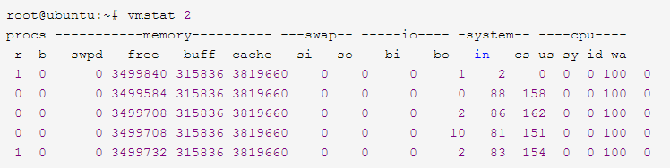

## Linux性能分析 
* 发现服务器的性能瓶颈。服务器配置的不同能够承载的最大任务数不同，能够承载的压力也不同
* 测试范围及性能指标
	* cpu：车间工人
	* 内存：车间临时存储货物的仓库
	* 磁盘：车间真正的存储货物仓库
	* 网络：车间与外界的公路
	* 版本：车间装修，机器配置
### 进程和线程
* 定义和区别
* 进程：系统进行资源分配和调度的一个独立单位
* 线程：进程的一个实体，一个线程可以创建和撤销另一个线程
* 区别：
    * 一个线程属于一个进程，一个进程可以拥有多个线程
	* 线程是进程工作的最小单位
	* 一个进程会分配一个地址空间，进程和进程不共享地址空间。即不共享内存
	* 同一个进程下的不同多个线程，共享父进程的地址空间
	* 线程执行中需要协作同步。不同进程的线程见要利用消息通信的办法进行同步
	* 线程作为调度和分配的基本单位。进程作为拥有资源的基本单位
* 优缺点：
	* 进程
        * 每个进程相互独立，不影响主程序的稳定性，子进程崩溃不影响其他进程
		* 增加CPU，扩充性能
		* 尽量减少线程枷锁和解锁的影响，提供性能
		* 逻辑控制复杂/需要和主程序交互
		* 多进程调度开销大
	* 线程
        * 程序逻辑控制方式简单
		* 所有线程共享内存和变量
		* 线程消耗的总资源比进程少
		* 线程和主程序共享地址空间，最大内存地址受限
		* 线程之间同步和枷锁不易控制
		* 一个线程的崩溃影响整个程序的稳定性
### linux常用命令
* 帮住命令：man ,linux下的函数手册命令，可以查看所有命令的使用方法（汉化）
#### top
* 实时监控系统运行状态

* 图片解析
    * 第一行：   
      10:01:23 — 当前系统时间   
      126 days, 14:29 — 系统已经运行了126天14小时29分钟（在这期间没有重启过）   
      2 users — 当前有2个用户登录系统   
      load average: 1.15, 1.42, 1.44 — load average后面的三个数分别是最近1分钟、5分钟、15分钟的负载情况。      
      load average数据是每隔5秒钟检查一次活跃的进程数，然后按特定算法计算出的数值。如果这个数除以逻辑CPU的数量，结果高于5的时候就表明系统在超负荷运转了。
         * load average: 在特定时间间隔内运行队列中(在CPU上运行或者等待运行多少进程)的平均进程数。
         * 【注意】说明：在单核CPU中load average的值1时表示满负荷状态。同理在多核CPU中满负荷load average的值为1*CPU核数
    * 第二行：   
      Tasks — 任务（进程），系统现在共有183个进程，其中处于运行中的有1个，182个在休眠（sleep），stoped状态的有0个，zombie状态（僵尸）的有0个
    * 第三行：cpu状态   
        6.7% us — 用户空间占用CPU的百分比。
        0.4% sy — 内核空间占用CPU的百分比。
        0.0% ni — 改变过优先级的进程占用CPU的百分比
        92.9% id — 空闲CPU百分比
        0.0% wa — IO等待占用CPU的百分比
        0.0% hi — 硬中断（Hardware IRQ）占用CPU的百分比
        0.0% si — 软中断（Software Interrupts）占用CPU的百分比
    * 第四行：内存状态    
        8306544k total — 物理内存总量（8GB）   
        7775876k used — 使用中的内存总量（7.7GB）   
        530668k free — 空闲内存总量（530M）   
        79236k buffers — 缓存的内存量 （79M）       
    * 第五行：swap交换分区：LINUX下的虚拟内存分区,它的作用是在物理内存使用完之后,将磁盘空间(也就是SWAP分区)虚拟成内存来使用
        * 只有内存不够用会调用swap的内存
        2031608k total — 交换区总量（2GB）     
        2556k used — 使用的交换区总量（2.5M）    
        2029052k free — 空闲交换区总量（2GB）    
        4231276k cached — 缓冲的交换区总量（4GB） 
    * 第四行中使用中的内存总量（used）指的是现在系统内核控制的内存数，空闲内存总量（free）是内核还未纳入其管控范围的数量。纳入内核管理的内存不见得都在使用中，还包括过去使用过的现在可以被重复利用的内存，内核并不把这些可被重新使用的内存交还到free中去，因此在linux上free内存会越来越少，但不用为此担心。
    * 如果出于习惯去计算可用内存数，这里有个近似的计算公式：第四行的free + 第四行的buffers + 第五行的cached，按这个公式此台服务器的可用内存：530668+79236+4231276 = 4.7GB。
    * 对于内存监控，在top里我们要时刻监控第五行swap交换分区的used，如果这个数值在不断的变化，说明内核在不断进行内存和swap的数据交换，这是真正的内存不够用了。
    * 第六行是空行
    * 第七行以下：各进程（任务）的状态监控   
        PID — 进程id   
        USER — 进程所有者   
        PR — 进程优先级   
        NI — nice值。负值表示高优先级，正值表示低优先级   
        VIRT — 进程使用的虚拟内存总量，单位kb。VIRT=SWAP+RES   
        RES — 进程使用的、未被换出的物理内存大小，单位kb。RES=CODE+DATA   
        SHR — 共享内存大小，单位kb   
        S — 进程状态。D=不可中断的睡眠状态 R=运行 S=睡眠 T=跟踪/停止 Z=僵尸进程   
        %CPU — 上次更新到现在的CPU时间占用百分比   
        %MEM — 进程使用的物理内存百分比   
        TIME+ — 进程使用的CPU时间总计，单位1/100秒   
        COMMAND — 进程名称（命令名/命令行）   
* 多U多核CPU监控

    * 在top基本视图中，按键盘数字“1”，可监控每个逻辑CPU的状况：
* 能够监控系统的运行状态，并且按照cpu及内存等进行排序
		* 参数
		* -h:帮助
		* -p:监控指定进程，监控多个进程时，进程ID以逗号分隔，只能在命令行使用
		* 任务区命令
		* M:按照内存使用率排序
		* P:按照CPU使用率排序
		* z:彩色 黑白显示
		* 敲击键盘“b”（打开/关闭加亮效果）
#### vmstat参数
* 用途：监控系统进程的状态/内存/虚拟内存/磁盘io/cpu消息
* 参数：
    * -S:使用指定的单位显示-默认：K，eg:k(1000) K(1024) m(1000000) M(1048576)字节
* 实例：  vmstat  时间间隔     显示次数
* 图例讲解

    * r 表示运行队列(就是说多少个进程真的分配到CPU)，我测试的服务器目前CPU比较空闲，没什么程序在跑，当这个值超过了CPU数目，就会出现CPU瓶颈了。这个也和top的负载有关系，一般负载超过了3就比较高，超过了5就高，超过了10就不正常了，服务器的状态很危险。top的负载类似每秒的运行队列。如果运行队列过大，表示你的CPU很繁忙，一般会造成CPU使用率很高。
    * b 表示阻塞的进程,这个不多说，进程阻塞，大家懂的。
    * swpd 虚拟内存已使用的大小，如果大于0，表示你的机器物理内存不足了，如果不是程序内存泄露的原因，那么你该升级内存了或者把耗内存的任务迁移到其他机器。
    * free   空闲的物理内存的大小，我的机器内存总共8G，剩余3415M。
    * buff   Linux/Unix系统是用来存储，目录里面有什么内容，权限等的缓存，我本机大概占用300多M
    * cache cache直接用来记忆我们打开的文件,给文件做缓冲，我本机大概占用300多M(这里是Linux/Unix的聪明之处，把空闲的物理内存的一部分拿来做文件和目录的缓存，是为了提高 程序执行的性能，当程序使用内存时，buffer/cached会很快地被使用。)
    * si  每秒从磁盘读入虚拟内存的大小，如果这个值大于0，表示物理内存不够用或者内存泄露了，要查找耗内存进程解决掉。我的机器内存充裕，一切正常。
    * so  每秒虚拟内存写入磁盘的大小，如果这个值大于0，同上。
    * bi  块设备每秒接收的块数量，这里的块设备是指系统上所有的磁盘和其他块设备，默认块大小是1024byte，我本机上没什么IO操作，所以一直是0，但是我曾在处理拷贝大量数据(2-3T)的机器上看过可以达到140000/s，磁盘写入速度差不多140M每秒
    * bo 块设备每秒发送的块数量，例如我们读取文件，bo就要大于0。bi和bo一般都要接近0，不然就是IO过于频繁，需要调整。
    * in 每秒CPU的中断次数，包括时间中断
    * cs 每秒上下文切换次数，例如我们调用系统函数，就要进行上下文切换，线程的切换，也要进程上下文切换，这个值要越小越好，太大了，要考虑调低线程或者进程的数目,例如在apache和nginx这种web服务器中，我们一般做性能测试时会进行几千并发甚至几万并发的测试，选择web服务器的进程可以由进程或者线程的峰值一直下调，压测，直到cs到一个比较小的值，这个进程和线程数就是比较合适的值了。系统调用也是，每次调用系统函数，我们的代码就会进入内核空间，导致上下文切换，这个是很耗资源，也要尽量避免频繁调用系统函数。上下文切换次数过多表示你的CPU大部分浪费在上下文切换，导致CPU干正经事的时间少了，CPU没有充分利用，是不可取的。
    * us 用户CPU时间，我曾经在一个做加密解密很频繁的服务器上，可以看到us接近100,r运行队列达到80(机器在做压力测试，性能表现不佳)。
    * sy 系统CPU时间，如果太高，表示系统调用时间长，例如是IO操作频繁。
    * id  空闲 CPU时间，一般来说，id + us + sy = 100,一般我认为id是空闲CPU使用率，us是用户CPU使用率，sy是系统CPU使用率。
    * wt 等待IO CPU时间
#### free
* 用途：监控系统内存使用状态，
* 参数讲解：
    * total:总计物理内存的大小；used:已经使用的；free可用的；shared:多个进程共享内存总额；buffers/cached:磁盘缓存大小
    * free -h 加单位显示
#### 时实监控-cpu
* mpstat:特点：可以查看*多核心cpu中每个计算核心的统计数据*
* mpstat [-P{|ALL}][interal[count]]
* 参数
    * -P：定位监控的cpu，cpu在[0,cpu个数-1]中取值
    * interal: 相邻的俩次采样的间隔时间
    * count:采样次数
* 注意：没有参数显示系统启动以后所有信息的平均值   
        有interval:第一行显示系统启动以后所有信息的平均值，从第二行开始看
#### 实时监控-网络
* netstat
    * 参数：
    * -n：拒绝显示别名，能显示数字的显示数字
    * -l：仅列出监听的服务状态
    * -p：显示建立链接的程序名
    * -t(tcp):显示tcp相关选项
    * -u(udp):显示udp相关选项
    * -i：显示自动匹配接口的信息
    * -c: 间隔时间
    * 实例：
        * netstat -ntlp（查看此端口是否被监听）
        * netstat -i:查看是否有丢失或者错误的数据（查看网络传输大小和是否有error）
#### 实时监控-磁盘
* iostat
    * 参数：
    * -x:查看最后一个参数%util，此值大小觉得io读写的繁忙程度
    * [指定磁盘]：指定查看的硬盘
    * num :间隔时间
#### 万能命令 sar
* 定义：(system activity reporter系统活动情况报告)，是linux全面的性能分析工具
* 用途：文件读写、系统调用、磁盘IO、CPU效率、内存使用、进程活动、IPC活动
* 参数：
    * n:间隔
    * t：次数
    * -o 文件：结果输出到文件
    * [options]:
        * -A：报告综合
        * -u:cpu使用率
        * -r:内存使用情况
        * -B:内存分页情况
        * -b:缓冲区使用情况
#### 进程追踪命令 strace
* 用法:系统诊断、调试、统计于一身。可以完整的追踪进程的生命周期
* 参数：
    * -p：指定待跟踪的进程号(pid)
    * -f：跟踪当前进程及其通过fork系统调用所创建的子进程
    * -c：统计和报告每个系统调用所执行的时间、调用次数和出错次数等
    *  -t在每行输出前添加绝对时间戳(当前时钟)信息，精确到秒级    
        -tt在每行输出前添加绝对时间戳信息，精确到微秒级    
        -ttt在每行输出前添加相对时间信息，格式为”自纪元时间起经历的秒数.微秒数”         
    * -e expr:指定一个表达式，用于限定跟踪哪些事件及如何跟踪
    * -o file:strace输出信息默认显示到标准错误输出，该选项将输出信息写入文件file中。以下两条命令等效：
* 实例：strace -ff -F -o 文件名  命令      ->使用more命令来分步查看文件内容    
       查看文件中是否有-1，则有错误       
#### linux监控工具--nmon
* 用法：linux广泛使用监控+分析工具
    * 记录信息全面
    * 实时捕捉系统资源的使用情况
    * 输出到文件，图表展示
* 下载安装：wget http://sourceforge.net/projects/nmon/files/nmon16h.tar.gz    解压：tar -zxvf .gz   复制指定包到/usr/bin下
* 参数：
    * -f：必选参数，放在首位，输出文件，默认主机+时间.nmon
    * -F：用户自定义文件名称功能和-f一致
    * -s：采集频率
    * -c: 采集次数
    * -t: 输出最销号资源的进程 
* 使用：采集频率+采集次数=性能测试时间
* eg:nmon -f -F /usr/local/blog/result.nmon -s 3 -c 100 
* nmon结果数据分析工具--nmon_analyzer(需要使用excel的宏，wps安装插件)
    * 下载：ibm网址
    * 重点sheet页
        * SYS_SUMM  系统汇总页，包含cpu占有率、磁盘、io变化情况等信息
            * 系统汇总,蓝线为cpu占有率变化情况,粉线为磁盘IO的变化情况；
        * AAA 关于操作系统以及nmon本身的一些信息
        * CPUnn 显示执行时间内cpu占用的情况
        * CPU_ALL 所有CPU概述，显示所有CPU平均占用情况
            ```text
              a. User%，用户模式下执行的程序所使用的CPU百分比
              b. Sys%，内核模式下执行的程序所使用的CPU百分比
              c. Wait%，等待 IO 所花的时间百分比
              d. Idel%，CPU的空闲时间百分比，此值和User%，Sys%，Wait%之和等于1
              e. CPU%，CPU总体占用情况，这个值通常等于User%+Sys%+Wait%
              f. CPUs，CPU核数，即操作系统是多少C的
            ```
        * CPU_SUMM 每一个CPU在执行时间内的占用情况 
        * DGBUSY 磁盘组每个hdisk设备平均占用情况
        * DGREAD 每个磁盘组的平均读情况
        * DGWRITE 每个磁盘组的平均写情况
        * DGSIZE 每个磁盘组的平均读写情况
        * DGXFER 每个磁盘组的I/O每秒情况
        * MEM 内存相关信息、使用、空闲内存大小等
            ```text
              a. memtotal，物理内存总大小
              
              b. swaptotal，虚拟内存（即交换空间）的总大小
              
              c. memfree，剩余物理内存大小
              
              d. swapfree，剩余虚拟内存大小
              
              e. cached，已占用的文件系统缓存大小，由物理内存分配
              
              f. buffers，文件系统缓冲区大小
              
              g. swapcached，虚拟内存中已分配出来的内存大小
              
              h. inactive，最近不常使用的内存大小
            ```
        * NET 显示系统中每个网络适配器的数据传输速率（千字节/秒）
            ```text
                  a. Total-Read，网络适配器每秒接收的数据包总大小，单位是KB/sec
                  
                  b. Total-Write (-ve)，网络适配器每秒发送的数据包总大小，单位是KB/sec
                  
                  c. eth0-total，网络适配器每秒接收和发送的数据包总大小，单位是KB/sec
            ```
        * PAGE 本sheet统计相关页信息的记录
        * DISK_SUM：总体disk读、写以及I/O操作
            ```text
              a. Disk Read KB/s ，每个磁盘执行采样数据（磁盘设备的读速率）
              b. Disk Write KB/s ，每个磁盘执行采样数据（磁盘设备的写速率）
              c. IO/sec，每秒钟输出到物理磁盘的传输次数
            ```
        * DISKBUSY：每个hdisk设备平均占用情况   单位为%（百分比）
        
#### linux下定时任务--crontab
* 性能测试使用场景：结合nmon实现定时定点监控服务器性能
* 来源：linux系统是由cron这个系统服务来控制的，在系统中包含很多计划性任务。用户可以自定义计划任务，so-->crontab
* 命令：
    * /sbin/service crond status查看定时任务的服务是否启动
    * start/stop/restart 启动/停止/重启 服务
    * reload 重新载入配置
* 服务权限：
    * crontab的权限管理存储在cron.allow和cron.deny文件中。如果没有可以在/ect/目录下创建      
    * 使用场景：
        * 当俩个文件都不存在，只能root使用
        * .allow存在，.deny不存在，只允许allow用户使用
        * .allow不存在，.deny存在，非的deny用户都使用
        * 文件都存在，用户在俩文件中都存在，以allow为准
* 使用：
    * crontab -e:进入编辑页面
    * crontab -l：查看定时任务配置  date查看当前时间
    * crontab -r : 删除 crontab 文件。
    * crontab -ir : 删除 crontab 文件前提醒用户。
    * 基本格式：minute hour day month week command
        * minute:00-59、每分钟用 * 或者 */1标识
        * hour:
        -23(0表示0点)
        * day：日期01-31
        * month：01-12
        * week：0-6（0表示周末）
        * command：
    * 符号： * 代表取值范围所有值   
             / 代表每   
            - 代表从start-end   
            , 代表并列多个值

## 数据库性能测试结果分析
### 数据库常用架构
#### 一主多从

* 优点：分担单库的压力；缺点：读写延时
#### 双击热备
* 优点：类似负载均衡vip指向会变
* 原理：master将改变记录到二进制文件中->slaver拷贝日志文件到中继器（relog）-slaver模拟relog中的日志文件实现数据同步

### 数据库分库分表的设计方法
#### 拆分原因
单表/库数据量太大
硬件不能升级或无法升级
#### 方案
* 业务拆分

* 垂直拆分

* 水平拆分 

### 数据库性能测试Mysql篇
#### 主流分支
MariaDb：Mysql之父widenius创建，目标替换Mysql    
                 兼容Mysql，对于开发着来说感知不到变化    
                 免费开源    
### mysql数据库监控指标
* QPS：每秒查询数量   
show global status like ‘Question%’   
TPS: Tranaction per seconds=(Com_commit+Com_rollback)/seconds   
show global status like ‘Com_commit’   
show global status like ‘Com_rollback’   
* 线程连接数    
show global status like 'Max_used_connections’    
show global status like ’Threads%’    
* 最大连接数   
show variables like ‘max_connections’    
【注】使用连接数接近最大连接数，会报超出连接的错误     
* Query Cache    
查询缓存用于select的查询结果（没有insert和update）     
下次接收到相同的查询请求时，不再执行处理而是直接使用缓存中的结果    
适用于大量查询，很少改变表的数据     
设置缓存：修改my.cof文件     
                  将query_cache_size设置为具体的大小，最好时1024的配数，参考值32M      
增加一行：query_cache_type=0/1/2      
                   1 ：缓存所有的结果，除非select语句使用sql_no_cache禁用缓存     
                   2：只缓存select语句中通过sql_cache指定需要缓存的查询     
* query cache命中率    
show status like ‘Qcache%’    
Query_cache_hits=(Qcahce_hits/(Qcache_hits+Qcache_inserts))*100%      
* 锁定状态    
show global status like ‘%lock%’      
Table_locks_waited/Table_locks_immediate 值越大代表表锁造成的阻塞越严重      
Innoda_row_lock_waits innodb行锁，太大可能时间隙锁造成     
* 主从延时    
show slave status     
### mysql慢查询工作原理及操作
* 定义    
执行速度超过定义时间的查询    
不同系统定义不同的慢查询指标     
* 开启    
slow_query_log=1    
slow_query_log_file=/usr/local/mysql.log    
long_query_time=1：慢查询阈值，当查询时间多于设定的阈值时，记录日志     
    编辑/etc/my.cnf，在[mysqld]域中添加    
    开启：slow_query_log=1    
    日志路径：slow_query_log_file= 自定义    
    时长：long_query_time=1     
    未使用索引的查询也被记录到慢查询日志中：log_queries_not_using_indexes=1     
查看是否开启慢查询：show variables like '%slow_query_log%’;     
开启慢查询：set global slow_query_log=1;      
【注意】使用set global slow_query_log=1开启了慢查询日志只对当前数据库生效，MySQL重启后则会失效。如果要永久生效，就必须修改配置文件my.cnf（其它系统变量也是如此）     
连接mysql:mysql -uroot -p1—进入控制台     
重启mysql:service mysqld stop         
* 日志分析    
    命令：mysqldumpslow     
        -s 排序方式
                c 访问计数    l 锁定时间。  r 返回记录。t 查询时间      
                al 平均锁定时间 ar 平均返回记录数  at 平均查询时间       
        -t top n的意思返回前多少条数据      
        -g 后边正则匹配，大小写不敏感        
实例：mysqldumpslow -s r -t 10 slow.log（得到返回记录集最多的10个sql）    
           mysqldumpslow -s c -t 10 slow.log（得到访问次数最多的10个sql）     
           mysqldumpslow -s t -t 10 -g ”left join" slow.log（得到按照时间排序的前10条里面含有左连接的查询语句）      
### SQL的分析与调优方法
#### sql语句性能分析
* explain + sql     
    * id:select识别符，代表语句的执行顺序，在select嵌套查询中会不相同        
        数字越大越先执行，相同就顺序执行       
    * select_type          
        Simple 表示不需要union操作或不包含子查询的简单select语句      
                    有连接查询时，外层的查询为simple，且只有一个      
        primary：需要union或包含子查询的select，位于最外层的查询单位为primary，且只有一个    
        union     
        dependent union     
        union result     
        subquery     
        dependent subquery     
        derived      
    * table     
    显示查询表名称     
    <>代表中间表          
    * type******直观反应sql的重要性
    这是一个非常重要的参数，连接类型，常见的有：all , index , range , ref , eq_ref , const , system , null 八个级别。
    性能从最优到最差的排序：system > const > eq_ref > ref > range > index > all
    对 java 程序员来说，若保证查询至少达到 range 级别或者最好能达到 ref 则算是一个优秀而又负责的程序员。
    all：（full table scan）全表扫描无疑是最差，若是百万千万级数据量，全表扫描会非常慢。
    index：（full index scan）全索引文件扫描比 all 好很多，毕竟从索引树中找数据，比从全表中找数据要快。
    range：只检索给定范围的行，使用索引来匹配行。范围缩小了，当然比全表扫描和全索引文件扫描要快。sql 语句中一般会有 between，in，>，< 等查询。
    ref：非唯一性索引扫描，本质上也是一种索引访问，返回所有匹配某个单独值的行。比如查询公司所有属于研发团队的同事，匹配的结果是多个并非唯一值。
    eq_ref：唯一性索引扫描，对于每个索引键，表中有一条记录与之匹配。比如查询公司的 CEO，匹配的结果只可能是一条记录，
    const：表示通过索引一次就可以找到，const 用于比较 primary key 或者 unique 索引。因为只匹配一行数据，所以很快，若将主键至于 where 列表中，MySQL 就能将该查询转换为一个常量。
    system：表只有一条记录（等于系统表），这是 const 类型的特列，平时不会出现，了解即可
#### mysql索引的概念和作用
* 类型
    * 主键：特殊唯一索引，不允许空
    * 全文：fulltext，适用于myisam存储引擎
            数据类型：char/varchar/text   
            原理：match() against()   
    * 唯一:索引列必须有值，可以空
    * 组合:多列索引，好处：比分别创建多个单列索引快
    * 普通：没有限制
### mysql实时监控
orzdba
### mysql集群监控方案(天兔 Lepus)
* 支持MySQL、Oracle、SQLServer、MongoDB、Redis等数据库的基本监控和告警
* MySQL已经支持复制监控、慢查询分析和定向推送等高级功能
* Lepus无需在每台数据库服务器部署脚本或Agent，只需要在数据库创建授权帐号后，即可进行远程监控，适合监控数据库服务器较多的公司和监控云中数据库。

## Jmeter性能测试结果分析
### 分析性能测试结果
* 第一步:查看测试数据是否有效
    * 测试执行期间，测试环境是否稳定   
    eg:肉鸡cpu，内存使用过高、测试网络阻塞、待测系统参数配置错误
    * 检查Jmeter测试脚本参数设置是否合理、jmeter运行模式是否合理
    * 检查测试结果是否暴露出性能瓶颈
        * 重点关注异常测试结果
        * 待测系统是否存在机制屏蔽掉大部分压力 
* 第二步：性能测试分析模型
    * 起点：系统响应时长，判断是否满足期望->分析瓶颈点
        * Tn（网络响应时长）+Ts(服务器响应时长)
        * Jmeter无法区分Tn 和 Ts,可以使用总响应时长 - （ping服务器所用时间）
        * 分为：网络瓶颈问题+服务器瓶颈问题
    * 服务器瓶颈问题分为:应用服务器瓶颈问题+数据库服务器瓶颈问题
        * 应用服务器瓶颈问题              
        * 数据库服务器瓶颈问题
### 使用监听器发现性能测试缺陷
#### 图形结果（Graph Results）
* 作用：通过图形展示出本次性能测试数据的分布。 图形结果一般作为聚合报告的分析辅佐。
#### 样条视图
#### 聚合报告 Aggregate Report
* 记录这次性能测试的总请求数、错误率、用户响应时间（中间值、90%、最少、最大）、吞吐量等，用以帮助分析被测试系统的性能。在聚合报告中，各个响应时间不能超过客户的要求，就是合格，例如不能超过响应时间2s，大于2s就是不合格的.
#### 查看结果树 View Results Tree
* 作用：以结果树的形式显示测试结果。查看结果树监听器放置的位置不同，得到的结果也不同。在线程组下添加察看结果树，查看线程组下所有请求的结果；放在具体某个请求下，只查看此请求的结果；若放在某个控制器节点下，则查看此控制器下节点执行的结果。
#### 断言结果 Assertion Results
* 作用：用于检查测试中得到的响应数据等是否符合预期，用以保证性能测试过程中的数据交互与预期一致，一般与结果树结合使用。
  


