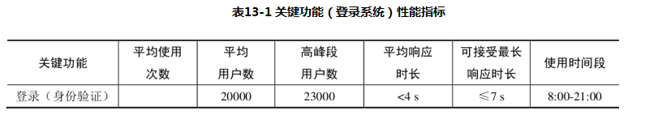

## 常规测试流程
### 测试背景和测试目标
* 目标：协助开发分析登录流程，哪一步存在瓶颈，并给以建议
* 需求分析
	* 熟悉项目使用操作流程
	* 明确测试指标
	* 明确测试场景
	    * 新系统
	        * 同行业比较
	        * 业务预期：阶梯增长/爆炸式增长
        * 老系统
            * 对比以往用户的使用行为以及用户量
### 分析确定性能测试指标

* 确认并发虚拟用户数
    * 测试环境平均并发数=（高峰段用户数* 10%）/n
        * n：生产/测试配置百分比
        * 一般：n=4（经验值）
* 确定性能测试持续时长
* 确定性能测试存量数据
* 确定关注指标    
    
### 录制创建测试脚本
* 添加CSV配置元件
* 添加事务
* 添加聚合报告
### 监控部署
### 运行测试脚本
    * 基准测试：多并发逻辑问题
    * 压测。。。
### 分析测试结果
    * 依赖于监控部署
    * 单看测试工具的报告是不全面的
### 上报性能缺陷


## 分布式压测

### linux安装配置Jmeter
   [博文链接](https://www.jianshu.com/p/47f6f576e547)
### Jmeter非GUI界面 需要用到的命令
```text
讲解：非GUI界面，压测参数讲解
            -h 帮助
            -n 非GUI模式
            -t 指定要运行的 JMeter 测试脚本文件
            -l 记录结果的文件 每次运行之前，(要确保之前没有运行过,即xxx.jtl不存在，不然报错)
            -r Jmter.properties文件中指定的所有远程服务器
            -e 在脚本运行结束后生成html报告
            -o 用于存放html报告的目录（目录要为空，不然报错）
```
* jmeter -n -t  JMeter 测试脚本文件 -l 录结果的文件 -e -o html报告的目录
* 运行脚本
sh /home/icode/local/apache-jmeter-5.1.1/bin/jmeter.sh -n -t /home/icoding/jmx/icoding_test.jmx 【-r远程启动】-l /home/icoding/jtl/icoding_test.jtl
* 生成报告
sh /home/icode/local/apache-jmeter-5.1.1/bin/jmeter.sh -g  /home/icoding/jtl/icoding_test.jtl -o /home/icoding/report
* linux文件赋权：chmod 777 xxx.jmx
* 打包
    * 压缩
tar -czvf test.tar.gz a.c   //压缩 a.c文件为test.tar.gz
    * 解压缩
tar -xzvf test.tar.gz 
* 远程拷贝(内网地址)：
    * scp -r /usr/local/software/jdk-8u141-linux-x64.tar.gz root@47.98.132.196:/usr/local/software
    * scp -r /usr/local/software/jmeter/apache-jmeter-4.0.tgz root@172.18.230.233:/usr/local/software/jmeter
* 启动：./jmeter-server 或者    nohup ./jmeter-server &
* 检查启动是否成功   
          ps -ef|grep jmeter-server   
          ps aux|grep jmeter-server
### 讲解Jmeter压测减少资源使用的一些建议，即压测结果更准确
```text
    1、使用非GUI模式：jmeter -n -t test.jmx -l result.jtl
    2、少使用Listener， 如果使用-l参数，它们都可以被删除或禁用。
        1>如果有listener，使用采样批次回传
    3、在加载测试期间不要使用“查看结果树”或“查看结果”表监听器，只能在脚本阶段使用它们来调试脚本。
    4、包含控制器在这里没有帮助，因为它将文件中的所有测试元素添加到测试计划中。]
    5、不要使用功能模式,使用CSV输出而不是XML
    6、只保存你需要的数据,尽可能少地使用断言
    7、如果测试需要大量数据，可以提前准备好测试数据放到数据文件中，以CSV Read方式读取。
    8、用内网压测，减少其他带宽影响压测结果
    9、如果压测大流量，尽量用多几个节点以非GUI模式向服务器施压
```
   [官方推荐](http://jakarta.apache.org/jmeter/usermanual/best-practices.html#lean_mean)
### 实战
#### 压测模拟图

#### 准备工作
* 注意事项
    * 系统上的防火墙被关闭或正确的端口被打开。
    * 所有的客户端都在同一个子网上。
    * 如果使用192.x.x.x或10.x.x.x IP地址，则服务器位于同一子网中。 如果服务器不使用192.xx或10.xx IP地址，则不应该有任何问题。
    * 确保JMeter可以访问服务器。
    * 确保在所有系统上使用相同版本的JMeter和Java。 混合版本将无法正常工作。
    * 您已为RMI设置SSL或将其禁用
    * 压测注意事项：一定要用内网IP，不用用公网IP,用ping去检查
* 肉鸡配置线程数参考：
    * 1.4-3G hz的cpu 1GB的Jmeter客户端，可处理线程数100-300；webservice例外
    * 所有负载一台机器网卡、交换机端口会产生瓶颈，一般客户端线程数未100
* 专业名词
    * master:司令
    * slave：奴隶
    * target：目标
* 相关资料：   
  https://www.cnblogs.com/Fine-Chan/p/6233823.html   
  https://blog.csdn.net/liujingqiu/article/details/52635289   
  https://www.cnblogs.com/puresoul/p/4844539.html   
  https://www.cnblogs.com/yangxia-test/p/4016277.html#408692
#### 安装常见问题
```text
1、问题
    [root@iZwz95j86y235aroi85ht0Z bin]# ./jmeter-server
    Created remote object: UnicastServerRef2 [liveRef: [endpoint:[:39308](local),objID:[24e78a63:16243c70661:-7fff, 7492480871343944173]]]
    Server failed to start: java.rmi.RemoteException: Cannot start. Unable to get local host IP address.; nested exception is:
    java.net.UnknownHostException: iZwz95j86y235aroi85ht0Z: iZwz95j86y235aroi85ht0Z: Name or service not known
    An error occurred: Cannot start. Unable to get local host IP address.; nested exception is:
    java.net.UnknownHostException: iZwz95j86y235aroi85ht0Z: iZwz95j86y235aroi85ht0Z: Name or service not known
    解决：
        hostname  命令获取机器名称，追加一个映射  iZwz95j86y235aroi85ht0Z
        vim /etc/hosts
            127.0.0.1   localhost localhost.localdomain localhost4 localhost4.localdomain4
            ::1         localhost localhost.localdomain localhost6 localhost6.localdomain6
            120.79.160.143 iZwz95j86y235aroi85ht0Z
        windows用户 修改c:\windows\system32\drivers\etc\hosts文件，增加一条域名 与IP的映射
2、问题
    [root@iZwz95j86y235aroi85ht0Z bin]# ./jmeter-server
    Server failed to start: java.rmi.server.ExportException: Listen failed on port: 0; nested exception is:
    java.io.FileNotFoundException: rmi_keystore.jks (No such file or directory)
    An error occurred: Listen failed on port: 0; nested exception is:
    java.io.FileNotFoundException: rmi_keystore.jks (No such file or directory)
   解决：
           拥有RMI over SSL的有效密钥库，或者禁用了SSL。
           1、禁用SSL
               jmeter.property里面 server.rmi.ssl.disable 改为 true，表示禁用
3、问题：
            [root@iZ949uw2xehZ bin]# ./jmeter
        Java HotSpot(TM) 64-Bit Server VM warning: INFO: os::commit_memory(0x00000000c0000000, 1073741824, 0) failed; error='Cannot allocate memory' (errno=12)
        #
        # There is insufficient memory for the Java Runtime Environment to continue.
        # Native memory allocation (mmap) failed to map 1073741824 bytes for committing reserved memory.
        # An error report file with more information is saved as:
        # /usr/local/jmeter/apache-jmeter-4.0/bin/hs_err_pid5855.log
    解决：
        编辑jmeter
        搜索 : "${HEAP:="-Xms1g -Xmx1g -XX:MaxMetaspaceSize=256m"}"
        改变初始堆内存和最大堆内存
4、连接失败原因排查
      以下步骤进行排查：
          1. jmeter-server是否启动；
          2. 是否联网
          3. ping 服务器IP是否畅通.
          4. telnet 端口 192.168.3.10 1099
          5. 检查服务器的防火墙是否关闭。
          6. 阿里云安全策略是否正常
5、"could not find ApacheJmeter_core.jar"
    解决：在Agent机器安装jdk，并设置环境变量
6、”Bad call to remote host"
    解决：检查被控制机器上的jmeter-server有没有启动，或者remote_hosts的配置是否正确。
7、jmeter 分布式性能测试（多网卡配置）
    我们要在多网卡的服务器上开启RMI服务的话必须指定IP，使他们能够在同一个网段内。
    需要以下几步（假定所有机器都在10.120.11.*网段,agent服务器为linux,controller服务器为windows）：

    1、 修改agent服务器，指定agent机器的IP
    修改jmeter-server文件
    # vi jmeter-server
    修改RMI_HOST_DEF=-Djava.rmi.server.hostname=xxx.xxx.xxx.xxx(需要连接的IP)

    2、修改server服务器，指定server机器的IP

    修改jmeter.bat文件

    新增set rmi_host=-Djava.rmi.server.hostname=10.120.11.214

    修改set ARGS=%DUMP% %HEAP% %NEW% %SURVIVOR% %TENURING% %PERM% %DDRAW% %rmi_host%
```
#### 配置文件修改
* master配置   
    Jmeter.properties：remote_hosts=192.168.xx.xx:1099,192.168.aa.bb:1099 
* slave配置
* 端口配置  
        server.rmi.localport=8899 表示slave server启动显示的端口   
        server_port=8899  表示master机器要远程连接的端口   即 remote_hosts=xxxx:8899   
### 压测报告讲解
```text
31、Jmeter图形化HTML压测报告Charts报表讲解
    简介：
        讲解压测报告 html里面Charts的核心指标
        1、charts讲解
            1)Over Time（随着时间的变化）
                Response Times Over Time：响应时间变化趋势
                Response Time Percentiles Over Time (successful responses)：最大，最小，平均，用户响应时间分布
                Active Threads Over Time：并发用户数趋势
                Bytes Throughput Over Time：每秒接收和请求字节数变化，蓝色表示发送，黄色表示接受
                Latencies Over Time：平均响应延时趋势
                Connect Time Over Time    ：连接耗时趋势

            1)Throughput
                Hits Per Second (excluding embedded resources):每秒点击次数
                Codes Per Second (excluding embedded resources)：每秒状态码数量
                Transactions Per Second：即TPS，每秒事务数
                Response Time Vs Request：响应时间和请求数对比
                Latency Vs Request：延迟时间和请求数对比

            1)Response Times
                Response Time Percentiles：响应时间百分比
                Response Time Overview：响应时间概述
                Time Vs Threads：活跃线程数和响应时间
                Response Time Distribution：响应时间分布图
30、Jmeter图形化HTML压测报告dashboard讲解
    简介：
        讲解压测报告 html里面Dashboard的核心指标
        1、dashboard讲解
            1）Test and Report informations
                Source file：jtl文件名
                Start Time ：压测开始时间
                End Time ：压测结束时间
                Filter for display：过滤器
                Lable:sampler采样器名称    

            2）APDEX(Application performance Index)
                apdex:应用程序性能指标,范围在0~1之间，1表示达到所有用户均满意
                T(Toleration threshold)：可接受阀值
                F(Frustration threshold)：失败阀值

            3）Requests Summary
                OK:成功率
                KO:失败率
            4）Statistics 统计数据
                lable:sampler采样器名称

                samples:请求总数，并发数*循环次数
                KO:失败次数
                Error%:失败率

                Average:平均响应时间
                Min:最小响应时间
                Max:最大响应时间
                90th pct: 90%的用户响应时间不会超过这个值（关注这个就可以了）
                2ms,3ms,4,5,2,6,8,3,9

                95th pct: 95%的用户响应时间不会超过这个值
                99th pct: 99%的用户响应时间不会超过这个值 (存在极端值)
                throughtput:Request per Second吞吐量 qps

                received:每秒从服务器接收的数据量
                send：每秒发送的数据量
```


