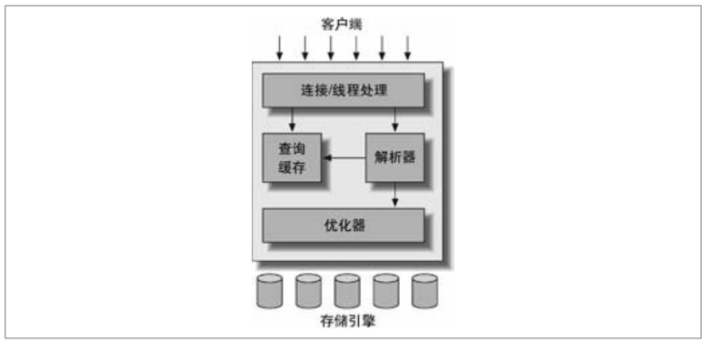
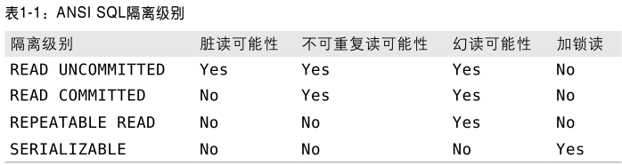
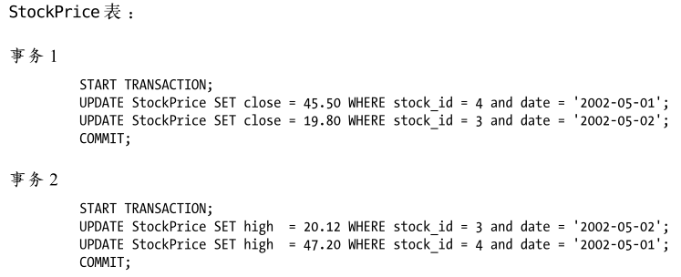
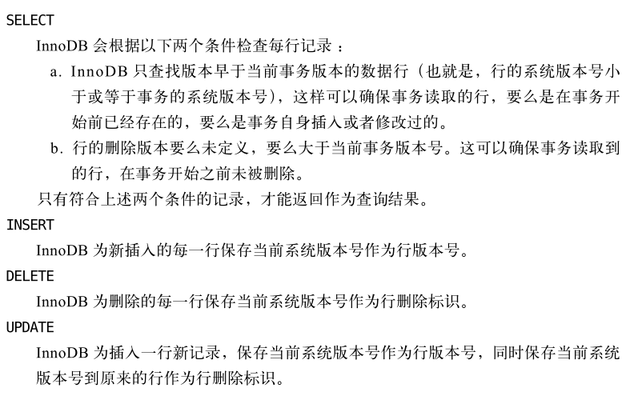
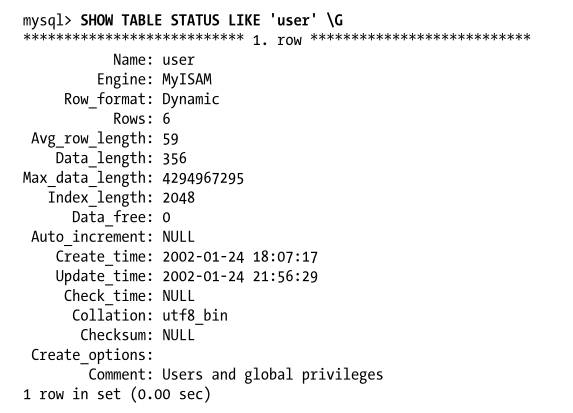

# 高性能Mysql
## 第一章 Mysql架构和历史
### 1.mysql逻辑架构

#### 客户端
基于网络的客户端/服务器的工具或服务都有类似架构，eg:连接处理，授权认证，安全等
#### 核心服务功能
服务功能包括查询解析、分析、优化、缓存以及所有的内置函数（日期、时间、数学等），所有跨存储引擎的功能都在这层实现（存储过程、触发器、视图）
#### 存储引擎
*负责mysql数据的存储和提取*
### 2.并发控制
#### 读写锁（共享/排他）
#### 锁粒度
* 表锁：基本锁策略，开销最小
* 行级锁：最大程度支持并发，开销大（实现于存储引擎层）
### 3.事务
* 原子性
* 隔离性：可能有许多事务会同时处理相同的数据，因此每个事务都应该与其他事务隔离开来，防止数据损坏。
* 一致性
* 持久性
#### 隔离性
 如果不考虑隔离性产生的三种后果:
* 1.脏读:在一个事务中,读取了另一个未提交事务中的数据.
* 2.不可重复读:一个事务范围内多次查询,返回了不同数据值(由于在查询间隔被另一个事务修改了)
* 3.幻读:一个事务批量修改表中的所有数据,这时另一个事务往表里新增了一条记录,导致第一个事务发现修改完之后落了一条,就跟产生幻觉一样
#### 隔离级别
* Serializable (串行化)：可避免脏读、不可重复读、幻读的发生。（读取每一行数据都加锁）
* Repeatable read (可重复读)：可避免脏读、不可重复读的发生(默认的隔离级别) 。
* Read committed (读已提交)：可避免脏读的发生。
* Read uncommitted (读未提交)：最低级别，任何情况都无法保证。
然级别越高，执行效率就越低。
```sql
#查看隔离级别
SELECT @@tx_isolation
#设置数据库隔离级别
SET  TRANSACTION ISOLATION LEVEL READ committed 
#设置当前会话隔离级别
SET SESSION TRANSACTION ISOLATION LEVEL READ committed 
```

#### 死锁
当多个事务试图以不同顺序锁定资源时，会产生死锁
##### 案例

##### 产生原因
* 数据冲突，如上
* 存储引擎的实现方式
##### 解决方案
数据库系统实现了各种*死锁检测*和*死锁超时*机制-->需要回滚死锁的事务
#### 事务日志
预写式日志（修改数据需要俩次磁盘）   
提高事务的效率：事务-->修改数据表的内存拷贝-->修改行为记录为事务日志-->事务日志持久化-->修改硬盘数据表
#### MySQL中事务
##### 自动提交（AUTOCOMMIT）
mysql默认自动提交
```sql
--查看提交状态
SHOW VARIABLES LIKE 'AUTOCOMMIT'
--设置
SET AUTOCOMMIT =1
```
##### 事务中混合使用存储引擎
事务是由下层的存储引擎实现的，so*同一个事务中使用多种存储引擎是不可靠的*   
例如：事务中使用混合使用InnDB（事务）和MyISAM表：如果事务回滚，MyISAM表不会回滚
##### 隐式锁与显式锁
* mysql锁分为隐式锁和显式锁。当多个客户端并发访问同一个数据的时候，为了保证数据的一致性，数据库管理系统会自动的为该数据加锁、解锁，这种被称为隐式锁。隐式锁无需开发人员维护（包括锁粒度、加锁时机、解锁时机等）
* 当时在某些特殊的情况下需要开发人员手动的进行加锁、解锁，这种锁方式被称为显式锁。对于显式锁而言，开发人员不仅要确定锁的粒度，还需要确定加锁的时机（何时加锁）、解锁的时机（何时解锁）以及所的类型。
### 4.多版本并发控制
>mysql的大多数事务型存储引擎实现的都不是简单的行级锁,基于提升并发性能的考虑.他们一般都同时实现了多版本并发控制(MVCC)不仅是mysql,包括oracle,pgsql其他数据可以也实现了mvcc,但是实现的机制不同,没有统一实现标准
#### 定义：
可以认为MVCC是行级锁的一个变种,但是很多情况下避免了加锁操作,因此开销更低.虽然实现机制各有不同,但大都实现了非阻塞的读操作,写操作也只锁定必要的行
#### 分类：
不同的存储引擎的MVCC实现的不同,典型的有乐观并发控制和悲观并发控制
#### 原理讲解
innodb的MVCC是通过在每行记录的后面保存两个隐藏的列来实现的.这2个列,一个保存了行的创建时间,一个保存了行的过期时间(或者删除时间).    
当然存储的并不是实际的时间值,而是系统的版本号.*每开始一个新的事务,系统版本号都会自动递增.*
#### 实例说明（InnoDB的MVCC）
Repeatable read (可重复读)：避免查询查到未提交的事务的修改，查询多次查询查到已经提交事务的修改   
  
#### 【注意】
* 不足之处是每行记录都需要额外的空间,需要做更多的检查,以及一些额外的维护工作
* MVCC只在REPEATABLE READ 和 READ COMMITTED 两个隔离级别下的工作
* 其他隔离级别都和MVCC不兼容,因为READ UNCOMMITTED总是读取最新的数据行,而不是符合当前事务版本的数据行,而SERIALIZABLE会对所有读取的行都要加锁
### 5.MySQL的存储引擎
>在文件系统中,Mysql将每个数据库（schema）报存为数据目录下的一个子目录。创建表时会在子目录下创建一个同名的.frm 文件，报存该表的定义
#### 数据库表定义
```sql
SHOW TABLE STATUS LIKE 表名
```
  
#### 数据库表定义解析
* Name：表名   
* Engine：使用的存储引擎
* Row_format：行格式
* Rows：表中的行数，对于MyISAM和一些引擎该值是确定的，InnoDB该值是估计值
* Avg_row_length：平均每行包含的字节数
* Data_length：表数据的大小（单位字节）
* Max_data_length：表数据的最大容量，该值与存储引擎有关
* Index_length：索引的大小（单位字节）
* Auto_increment:下一个auto的值
* Collation：表的默认字符集和字符列的排序规则
* ...
#### 1>InnDB存储引擎
>MySQL默认事务型存储引擎，使用最总要，最广泛的引擎
* Innodb采用MVCC来支持高并发,并且实现了四个标准的隔离级别,其默认级别是REPEATABLE READ(可重复读),并且通过间隙锁策略防止幻读的出现,间隙锁使得Innodb不仅仅锁定查询涉及的行,还会对索引中的间隙进行锁定,以防止幻影行的插入
* Innodb表是基于聚簇索引建立的。聚簇索引对主键查询有很高的性能,不过他的二级索引(非主键索引)中必须包含主键列,所以如果主键列很大的话,其他的所有索引都会很大。因此,若表上的索引较多的话,主键应当尽可能的小
* Innodb的存储格式都是平台独立的,也就是说可以将数据和索引文件从一个平台复制到其他平台
#### 2>MyISAM存储引擎
#### 3>MySql其他内建存储引擎
Archive引擎
Blackhole引擎
CSV引擎
Federated引擎
Memory引擎
Merge引擎
NDB集群引擎
#### 4>第三方存储引擎
#### 5>选择合适的存储引擎
* 事务   
    * 事务支持：InnoDB/XtraDB
    * 不需要事务，主要是select和insert，使用MyISAM,eg:日志型的应用符合这一特性
* 备份
    * 热备份：InnoDB
    * 如果定期关闭服务器备份，不需要   
* 奔溃恢复
    * 数据量大的时候，快速奔溃恢复（InnoDB > >MyISAM） 
#### 6>使用存储引擎举例
* 日志型应用
    * 要求插入速度快，使用MyISAM或者Archive,因为这些引擎开销低，插入速度快
    * 对记录的日志做分析报表（生成报表的sql会导致插入变慢）
        * 方案一：利用MySql内置的复制方案将数据复制到备份库，在备份库执行时间和CPU查询
        * 方案二：在日志表的名字中包含年月信息，这样可以在没有插入操作的历史表上频繁查询操作，不会干扰到插入的表
* 只读或者大部分情况只读的表
    * 典型场景：读多写少的业务，不考虑奔溃恢复MyISAM合适，MyISAM只将数据写到内存，操作系统定期刷到磁盘        
* 订单处理
    * InnoDB支持事务的必要性
* 电子公告牌和主题讨论论坛
* CD-ROM应用
    * 在不同的介质之间相互拷贝,MyISAM
* 大数据量
#### 7>转换表的存储引擎
三种方法：
* ALTER TABLE
    * ALTER TABLE 表名 ENGINE=引擎名称
    * 特点：执行时间长。（Mysql将数据从原表复制到新表，复制期间销号I/O能力,原表会加锁）
    * 失去原表所有的相关特性，eg:InnoDB->MyISAM->InnoDB,元InnoDB的所有外键会消失
* 导出和导入
    * 使用mysqldump工具将数据导出到文件，然后修改存储引擎，重新导入表和数据
* 创建和查询（create和insert）
    * 创建新表，insert ... select ...
    * 工具：pt-online-schema-change
### 6.Mysql时间线（timeline）
## 第二章 Mysql基准测试
## 第三章 服务器性能剖析
## 第四章 Schema与数据类型优化
### 1.选择优化的数据类型
* 更小的通常更好：使用更小的数据类型
* 简单的就好：eg 整型优于字符型
* 避免null：包含null的列使的索引、索引统计、值比较更负责
#### 整数类型
* TINYINT,SMALLINT,MEDIUMINT,INT,BIGTNT(8、16、24、32、64位)
* 可选属性:UNSIGNED-不允许负数
#### 实数类型
* FLOAT DOUBLE（4、8位）标准浮点进行近似计算
* DECLMAL 用于存储精确小数(性能低)
* eg:要求精度万分之一分，将金额乘以一百万，存入BIGINT中，--可以避免浮点不精确、DECLMAL的性能差
#### 字符串类型
* varchar 存储可变长字符串
    * 节省存储空间，对性能有帮助
* char 存储定长 eg:密码、性别
#### BLOB 和TEXT 类型
* BLOB 存储二进制数据，没有排序规则和字符集
* TEXT 存储字符集和排序规则
* 排序规则：只能对列前面指定长度进行排序，（ORDER by SUSTRING(column,length)或者指定max_sort_length）
#### 枚举ENUM代替字符串
* 数字-字符串映射关系，查找表
* 关联查询：避免枚举和varchar进行关联
* 好处：
    * 枚举关联枚举QPS效率高于varchar关联varchar
    * 占用存储空间更小
#### 日期和时间类型
* DATETIME: 范围1001-9999年，精度秒、8个字节
* TIMESTAMP：范围1970-2038年 ,精度秒、4个字节
#### 位数据类型
#### 选择标识符
* 整数类型：标识符最好的类型，快并且可以自增
* ENUM和SET: 适合存储固定的类型eg:有序的状态、产品类型、性别
* 字符串类型：
#### 特殊类型数据
eg:IPv4地址，通常使用varchar(15)存储----youhua---->使用函数INET_ATON()和INET_NTOA()进行切换
### 2.MySql设计中的缺陷
#### 太多的列
#### 太多的关联
#### 全能的枚举
#### 非此发明的null
### 3.范式和反范式
#### 三范式
* 第一范式：数据库表中的每一列都是不可分割的原子数据项  
eg: eg:班级：高三年1班，应改为2个字段，一个年级、一个班级，才满足第一范式，否则不满足第一范式。
* 第二范式：属性完全依赖于主键  
定义：满足第一范式前提，当一个主键由多个属性共同组成时，才会发生不符合第二范式的情况。比如有两个属性的主键，不能存在这样的属性，它只依赖于主键中的一个属性，这就是不符合第二范式 通俗解释：任意一个字段都只依赖表中的同一个字段 
* 第三范式：属性不能传递依赖于主属性  
定义：满足第二范式前提，如果某一属性依赖于其他非主键属性，而其他非主键属性又依赖于主键，那么这个属性就是间接依赖于主键，这被称作传递依赖于主属性。 通俗理解：*一张表最多只存2层同类型信息*
 

    


